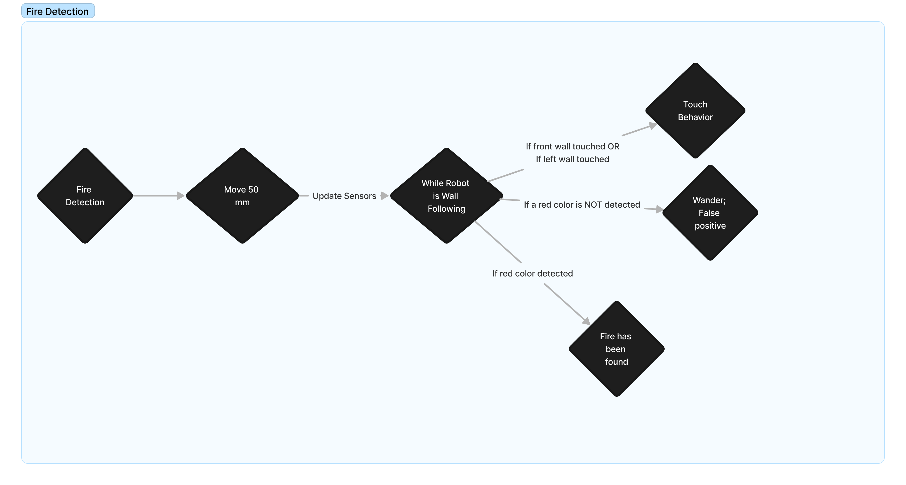

# LEGO EV3 Alarm Robot 

This project implements a control system for a LEGO EV3 robot using Python and the pybricks library. The robot is equipped with various sensors, including touch, color, and ultrasonic sensors, and is designed to exhibit different behaviors based on sensor input. Part of the CSE 4360 Autonomous Robot Design Course (Manfred Huber) (2023).

## Contents
- [Documentation](./docs/docs.pdf)
- [Documentation](./docs/report.pdf)
- [Subsumption/Behavior Based Module](behaviors.py)
- [Control System](robotics.py)
- [Global variables and Constants](globals.py)
- [Example LogFile](log.txt)

## Prerequisites
- A Windows 10 or Mac OS computer
- Internet access and administrator access
- A microSD card
- A mini-USB cable
- Vscode
- `Python 2.7xx` or higher
- LEGO® MINDSTORMS Education EV3 MicroPython Kit (https://pybricks.com/ev3-micropython/)

## How to Run

1. Clone this repository
2. Follow the steps on how to run programs on the lego ev3 here:https://pybricks.com/ev3-micropython/startbrick.html
3. Before running the prgram, configure your constants and variables in the `globals.py`.
4. After configuration, you can plug in the lego ev3 robot into your pc, click the `debugger`, then click `Download and run`

## Configuration

Adjust the constants and variables in `globals.py` to fine-tune the robot's performance based on your specific requirements.

## Project Structure

The project is organized into several modules:

### 1. `robotics.py`

This module contains the main classes responsible for the robot's control and behavior.

- `Navigator`: Keeps track of the robot's logical orientation.
- `Robot`: Custom-defined class for the LEGO EV3 robot, responsible for moving and turning.

### 2. `behaviors.py`

Defines different behaviors for the robot, each represented by a class:

- `RobotBehavior`: Coordinates the robot's behaviors based on priority.
- `TouchBehavior`: Handles robot actions when it touches a wall.
- `FireDetection`: Manages robot behavior when it detects a red color (fire).
- `WallFollowing`: Coordinates behaviors when the robot gets close to a wall.
- `Wander`: Default behavior, causing the robot to move forward until other stimuli are detected.

### 3. `main.py`

The main script orchestrating the robot's actions. It initializes the robot, sensors, and motors, continuously updates sensor data, and processes behaviors based on priority.

### 4. `globals.py`

Contains constants and variables that can be modified before compile time. These values are crucial for the robot's behavior and can be adjusted to fine-tune its performance.

### 5. `logger.py`

Responsible for logging data to `log.txt` on the LEGO EV3 brick. The `log` function logs messages and timestamps to both the console and the log file.

## Important Constants

- `TIRE_RPM`: Revolutions per minute of the robot's tires.
- `MIN_WALL_DISTANCE`: Distance from the wall where the robot activates wall following.
- `BACKUP_DISTANCE`: Distance the robot moves backward when recalibrating.
- `WALL_DISTANCE`: Threshold distance for the robot to consider it is no longer near the wall.

## Robot Design

## Flow Diagrams

## Contributors
- Aman Hogan-Bailey
- Sai Karthik Reddy Muddana Laligari
- Trieu Nguyen
- The University of Texas at Arlington
- LEGO® MINDSTORMS Education EV3
